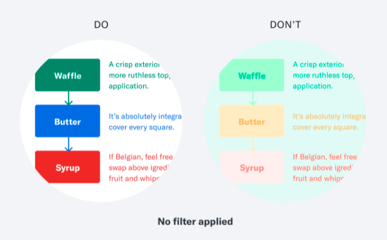
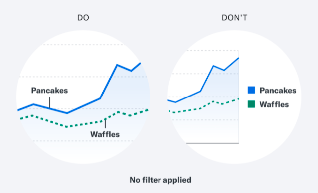
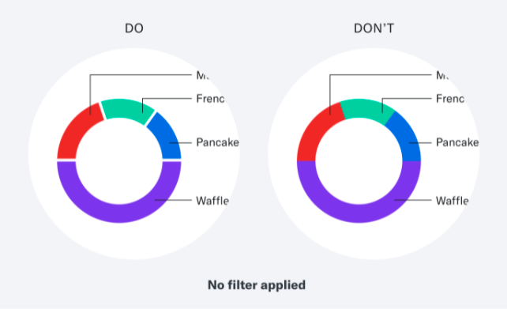
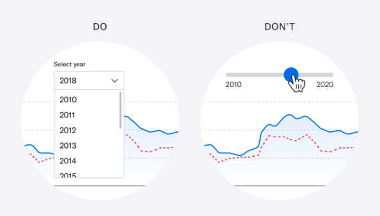

Este documento corresponde a la organización del tutorial, contiene la distribución de tiempos y temáticas a abordar de la misma con ejemplos citados de la bibliografía consultada, para el desarrollo del tutorial se están preparando los ejemplos correspondientes a cada eje para trabajarlos durante el desarrollo de la jornada en un proyecto de Rstudio con rmarkdown.


## Agenda

Este es un curso corto de 2 horas, en el cual se desarrollarán los siguientes ejes:


|Tiempo (en minutos) | Temática | 
|:---:|:------|:------|
|15 | Presentación del tutorial |
|25 | Eje 1: Gráficos efectivos en R con ggplot2 y plotly  |
|5  | Break 1 |
|25 | Eje 2: Accesibilidad en la visualización de datos |
|5  | Break 2|
|30 | Práctica guiada |
|10 | Preguntas finales |
|5  | Encuesta y cierre|


## Desarrollo de ejes: tópicos y ejemplos


## *Eje 1 Gráficos efectivos en R con ggplot2 y plotly*
 
 
¿Para qué visualizamos? 


Según Alberto Cairo, autor del libro The Truthful Art, lo hacemos para expresar y transmitir el significado de los datos de manera precisa, clara, atractiva, imaginativa, bella y confiable con el objetivo de informar al público, a nuestro público. Para ello, es importante tener en cuenta las cinco cualidades de una gran visualización:


- Que sea agradable a la vista
- Que sea funcional
- Que muestre hallazgos
- Que está basada en datos confiables, es decir, que transmita la verdad 
 
## *Eje 2 Accesibilidad en la visualización de datos*
 
Breve introducción sobre accesibilidad digital y por qué es importante su uso.

### Principios de accesibilidad y diseño accesible.

Entonces, ¿qué y a quién debemos tener en cuenta al crear tablas o gráficos?
Si bien es importante tener en cuenta los diferentes perfiles de accesibilidad al momento de crear productos digitales, las discapacidades o diversidades visuales son las más relevantes cuando consideramos la visualización de datos.

El diseño es más que color, forma o fuente: es una herramienta poderosa que media en nuestra relación con el mundo. El diseño inclusivo es eso, más potencial: el potencial de unir culturas heterogéneas en un entendimiento compartido. Hacer que los productos y las experiencias sean accesibles a nivel mundial. Para conectarnos.
 
Los diseños verdaderamente inclusivos nunca están realmente terminados, y adquirir fluidez en el diseño inclusivo requiere más que una lista de verificación. Sin embargo, todos necesitamos un mapa cuando comenzamos a explorar cualquier mundo nuevo: deje que esta lista de ideas lo inspire y oriente a usted y a su equipo a medida que comienza su viaje hacia el diseño inclusivo.


### Pautas básicas para hacer más accesibles las visualizaciones de datos.

Lo siguiente es cierto para cualquier visualización de datos, pero es especialmente importante cuando se enfoca en la accesibilidad. Un concepto conciso y coherente garantiza que los usuarios de todos los niveles puedan interactuar con su visualización. Deje los números a un lado por un momento y hágase estas preguntas:

*¿Qué historia cuentan los datos?*

Esto le ayuda a decidir en qué aspecto(s) enfocarse. 


*¿Cómo debería beneficiarse el lector de la visualización?*

Considere cómo su gráfico ayudará al usuario a comprender las perspectivas de los datos. 


*¿Puedes entenderlo en 5 segundos?*

Si lo visual agrega más complejidad que las palabras escritas, pensemos si lo necesitamos en primer lugar.

### Anatomía de un gráfico accesible

Análicemos el siguiente ejemplo de gráfico

```{r, echo=FALSE, fig.alt = "grafico con las cualidades de una buena visualización", out.width = "200%"}
knitr::include_graphics("fig/anatomia.png")
```


#### Pautas de diseño a tener en cuenta (desglosemos paso a paso):

- *Título:* Asigne a la visualización un título descriptivo que ilustre la idea principal.
Bien: “Mi consumo de helados en comparación con la media nacional”
Genial: “Un gráfico titulado: Mi consumo anual de helado ha superado el promedio nacional desde 2010. Desde los años 2000 a 2010, los niveles de consumo anual de helado míos y del estadounidense promedio son similares. Alrededor de 2010, mi nivel de consumo se dispara mucho más y se mantiene así hasta el día de hoy. El resumen de los datos es el siguiente…”


- *Resumen:* en el texto, resuma en palabras humanas reales la historia que la información busca transmitir. Este texto solo se puede descubrir mediante tecnología de asistencia. Si además es visible en pantalla sin esas herramientas, mejor aún.
Pregúntese: ¿Cómo describiría el gráfico y sus ideas a un amigo? Mejor aún, pídale a un amigo que lo analice y resuma lo que encuentre.
Etiquetas de eje (cuando corresponda): etiquete cada eje y sus marcas. Esto debe ser visible para el usuario y accesible a través de tecnología de asistencia.


- *Etiquetas de datos:* etiquete cada punto de datos directamente (use una línea de conexión, si es necesario) en lugar de usar una clave codificada por colores separada. Los usuarios que no pueden distinguir ciertos colores aún podrán interpretar los datos.
Tenga en cuenta lo siguiente durante la implementación:

- *Texto alternativo:* asegúrese de que su elemento visual tenga un texto alternativo descriptivo.
Mal: “ice_cream_conquisition_chart”
Genial: "El gráfico que muestra mi consumo anual de helado es mucho mayor que el promedio nacional"


- *Formato SVG:* si puede hacer un esfuerzo adicional, cree el gráfico utilizando SVG en lugar de una imagen HTML básica. Brinda una mejor experiencia a quienes usan lectores de pantalla, ya que permite el acceso a los elementos individuales dentro del gráfico. Lea más sobre gráficos SVG.


### *Mejores prácticas visuales*

En este apartado visualizaremos ejemplos brindados en el documento [A Comprehensive Guide to Accessible Data Visualization](https://www.betterment.com/design/accessible-data-visualization)

Para ayudar a las personas usuarias daltónicas: 

- Seguí las pautas de contraste de color.


```{r, echo=FALSE, fig.alt = "figura con dos visualizaciones, una con buen contraste y otra con un contraste deficiente", out.width = "50%"}

```


- Etiqueta los puntos de datos directamente.


```{r, echo=FALSE, fig.alt = "Figura con un ejemplo donde se etiquetan los puntos para mejorar la legibilidad del mismo", out.width = "50%"}

```

- Separa los elementos con espacios en blanco o patrón.


```{r, echo=FALSE, fig.alt = "Figura con un ejemplo donde se muestra como separar los elementos en un grafico de torta", out.width = "50%"}

```


Para apoyar a las personas usuarias la tecnología de asistencia:

- Evite herramientas complejas.


```{r, echo=FALSE, fig.alt = "Figura con un ejemplo donde se muestra un gráfico con interacción", out.width = "50%"}

```


- Evite las superposiciones de desplazamiento. 


```{r, echo=FALSE, fig.alt = "Figura con un ejemplo donde se muestra un gráfico de barras con etiquetas correctas", out.width = "50%"}
knitr::include_graphics("fig/ejemplo5.png")
```


## *Eje 3 Práctica*

Con lo aprendido en los ejes anteriores, en esta sección trabajaremos con una selección de bases datos de Tidy Tuesday,  y con scripts de gráficos gráficos pre-elaborados en ggplot2 y plotly  analizaremos sus características, ventajas y desventajas, y así aplicar funciones que creen visualizaciones efectivas y accesibles. 


