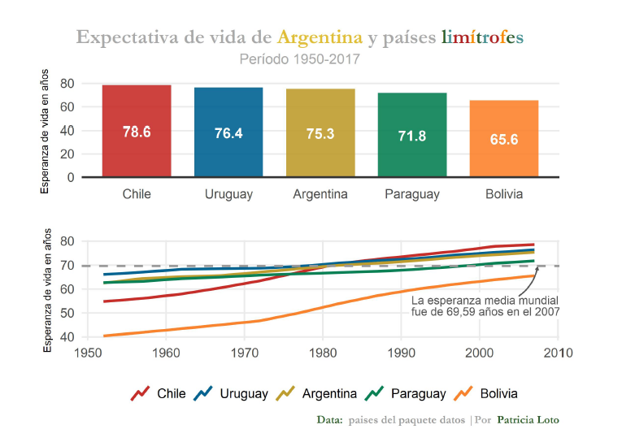
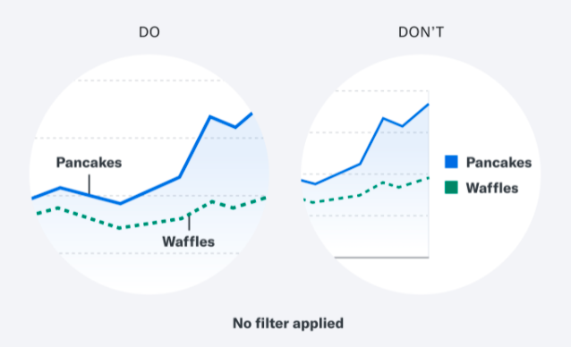
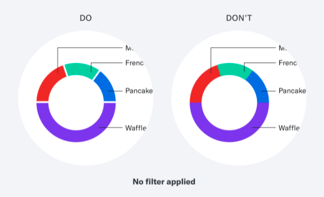
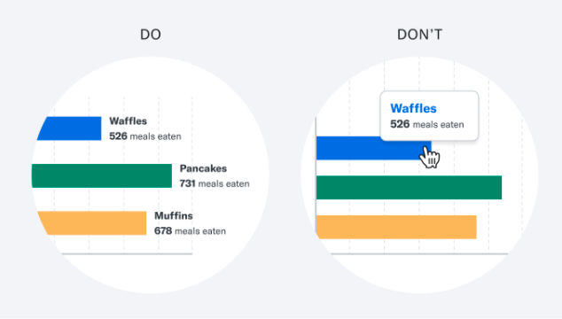

This document corresponds to the organization of the tutorial, it contains the distribution of time and topics to be addressed with examples from the bibliography consulted. For the development of the tutorial, examples corresponding to each axis are being prepared to work on them live with the attendees during the day in an Rstudio project. 


## Program


This is a 2-hour short course, in which the following topics will be covered


|Tiempo (en minutos) | Temática | 
|:---:|:------|:------|
|15 | Presentation of the tutorial |
|25 | Axis 1:     Effective plots in R with ggplot2 and plotly|
|5  | Break 1 |
|25 | Axis 2: Accessibility in data visualization |
|5  | Break 2|
|30 | Axis 3: Guided practice |
|10 | Final questions |
|5  | Survey and closing|


## Axis development: topics and examples


### Axis 1: Effective plots in R with ggplot2 and plotly
Why do we visualize? Why do we learn visualization? 

### Axis 2: Accessibility in data visualization
Brief introduction on digital accessibility and why its use is important.

#### *Principles of accessibility and accessible design*

So, what and who should we take into account when creating tables or graphs?
While it is important to consider different accessibility profiles when creating digital products, visual disabilities or diversities are the most relevant when considering data visualization.

Design is more than color, shape or font: it is a powerful tool that mediates our relationship with the world. Inclusive design is just that, more potential: the potential to unite heterogeneous cultures in a shared understanding. To make products and experiences globally accessible. To connect us.
 
Truly inclusive designs are never really finished, and becoming fluent in inclusive design requires more than just a checklist. However, we all need a map when we begin to explore any new world: let this checklist of ideas inspire and guide you and your team as you begin your journey toward inclusive design.

#### *Basic guidelines for making data visualizations more accessible*

The following is true for any data visualization, but it is especially important when focusing on accessibility. A concise and consistent concept ensures that users of all levels can interact with your visualization. 

Let's put the numbers aside for a moment and ask ourselves the following question:

- *What story does the data tell?* This helps you decide which aspect(s) to focus on. Imagine a graph showing the population of 10 major cities. If your goal is to compare San Francisco and New York, let the story shine. This means that Chicago's population is not as relevant and you can choose to minimize it. Similarly, if you have a particularly complex data set, you can break it down into smaller, simpler parts.


- *Can you understand it in 5 seconds?* If visuals add more complexity than written words, let's think about whether we need it in the first place

#### *Anatomy of an accessible graphic*
Let's analyze the following example of a chart


```{r, echo=FALSE, fig.alt = "sumar descripción", out.width = "200%"}

```


Design guidelines to consider (let's break down the design):

- *Title:* Assign the visualization a descriptive title that illustrates the main idea.
Good: "My ice cream consumption compared to the national average".
Cool: "A graphic titled: My annual ice cream consumption has exceeded the national average since 2010. From the years 2000 to 2010, mine and the average American's annual ice cream consumption levels are similar. Around 2010, my consumption level spiked much higher and remains so to this day. The summary of the data is as follows..."


- *Summary:* In the text, summarize in real human words the story the information seeks to convey. This text can only be discovered by assistive technology. If it is also visible on screen without those tools, even better.
Ask yourself: How would you describe the graph and its ideas to a friend? Better yet, ask a friend to analyze it and summarize what they find.


- *Axis labels (where applicable):* label each axis and its marks. This should be visible to the user and accessible through assistive technology.


- *Data labels:* label each data point directly (use a connecting line, if necessary) rather than using a separate color-coded key. Users who cannot distinguish certain colors will still be able to interpret the data.
Keep the following in mind during implementation:


- *Alternative text:* make sure your visual element has descriptive alternative text.
Bad: "ice_cream_conquisition_chart".
Great: "The chart shows how/that my annual ice cream consumption is much higher than the national average."


- *SVG format:* if you can go the extra mile, create the chart using SVG instead of a basic HTML image. It provides a better experience for those using screen readers, as it allows access to individual elements within the chart. Read more about SVG graphics.


#### *Visual best practices*

In this section we will look at examples provided in the document [A Comprehensive Guide to Accessible Data Visualization](https://www.betterment.com/design/accessible-data-visualization).

To help color blind users: 

- I followed the color contrast guidelines. 


```{r, fig.alt = "sumar descripción", out.width = "50%"}
knitr::include_graphics("fig/ejemplo1.png")
```

- Label data points directly


```{r, echo=FALSE, fig.alt = "sumar descripción", out.width = "50%"}

```

- Separate elements with white space or pattern. 


```{r, echo=FALSE, fig.alt = "sumar descripción", out.width = "50%"}

```

To support assistive technology users:

- Avoid complex tools
 
 
 
```{r, echo=FALSE, fig.alt = "sumar descripción", out.width = "50%"}
knitr::include_graphics("fig/ejemplo4.png")
```

- Avoid scrolling overlays


```{r, echo=FALSE, fig.alt = "sumar descripción", out.width = "50%"}

```

### *Axis 3: Guided practice*


With what we have learned in the previous axes, in this section we will work with a selection of Tidy Tuesday databases, and with pre-made plotting scripts in ggplot2 and plotly we will analyze their characteristics, advantages and disadvantages, and thus apply functions that create effective and accessible visualizations. 


